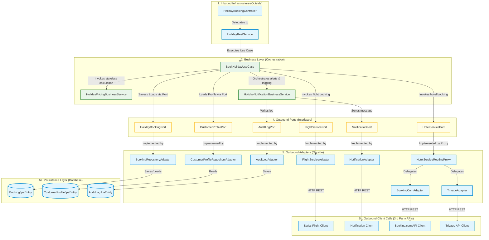
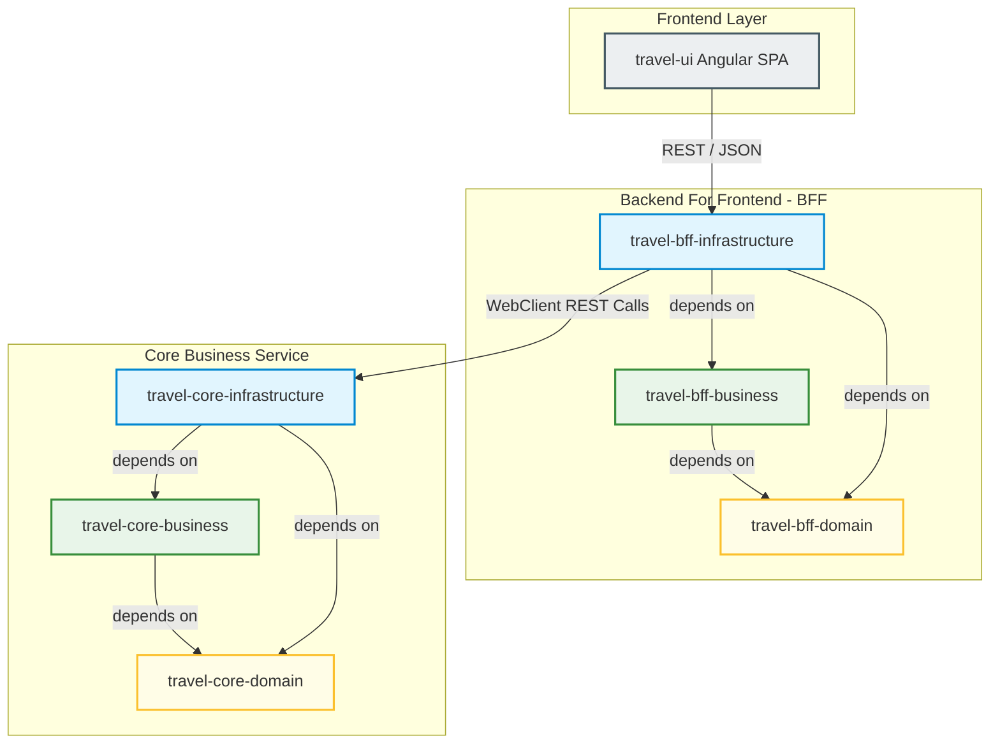

# Hexagonal Architecture Implementation (Ports & Adapters)

This document describes the implementation of the hexagonal architecture (Ports & Adapters pattern) within the **travel-core** service. The structure follows the physical control flow of an incoming API request: from the outer Inbound Infrastructure, through the Business Orchestration layer into the pure Domain Core, and finally out to the Outbound Adapters (Persistence and Third-Party APIs).

## Layer Overview (Control Flow)

### Color-Coding Legend for Submodules & Layers

| Layer / Submodule | Visuelle Farbe (1:1 Mermaid Style) | CSS-Hexcode | Beschreibung & Enthaltene Komponenten | 
 | ----- | ----- | ----- | ----- | 
| **Domain** | <span style="background-color:#fffde7; border:2px solid #fbc02d; color:#1a1a1a; padding:4px 8px; border-radius:4px; font-weight:bold; display:inline-block;">🟡 Domain</span> | BG: `#fffde7`<br>Border: `#fbc02d` | Reine Geschäftslogik ohne Framework-Abhängigkeiten. Beinhaltet Aggregate, Entities, Enums und Outbound-Port-Interfaces (`*-domain` Module). | 
| **Business** | <span style="background-color:#e8f5e9; border:2px solid #388e3c; color:#1a1a1a; padding:4px 8px; border-radius:4px; font-weight:bold; display:inline-block;">🟢 Business</span> | BG: `#e8f5e9`<br>Border: `#388e3c` | Orchestrierungsebene, Transaktionsgrenzen und UseCases. Beinhaltet fachliche Sagas und zustandslose Business Services (`*-business` Module). | 
| **Infrastructure** | <span style="background-color:#e1f5fe; border:2px solid #0288d1; color:#1a1a1a; padding:4px 8px; border-radius:4px; font-weight:bold; display:inline-block;">🔵 Infrastructure</span> | BG: `#e1f5fe`<br>Border: `#0288d1` | Technische Adapter, REST Controller, JPA Entities, Flyway-Konfigurationen und 3rd-Party-REST-Clients (`*-infrastructure` Module). | 


## Monorepo Project Structure

The project is organized as a multi-module Gradle Monorepo, decoupling the Frontend, the Backend-for-Frontend (BFF), and the Core Backend Service.

### Submodule Dependency Graph



### File & Folder Architecture

```text
travel/
├── settings.gradle.kts             # Declares all subprojects
├── build.gradle.kts                # Centralized root configuration & toolchains
│
├── travel-ui/                      # Angular Single Page Application (Frontend)
│   └── src/                        # Components, services and templates
│
├── travel-bff/                     # Gateway BFF (aggregates APIs & handles sessions)
│   ├── domain/                     # BFF-specific client mapping contracts
│   ├── business/                   # Lightweight aggregation logic
│   └── infrastructure/             # WebClient calling travel-core, Security Config (Depends on business & domain)
│
└── travel-core/                    # Central Business Domain Microservice
    ├── domain/                     # Pure business logic, Aggregate Root (No frameworks!)
    ├── business/                   # Transactional Orchestration Layer, UseCases, Ports (Depends on domain)
    └── infrastructure/             # Heavy Framework dependencies (Spring, JPA Entities, Flyway, PostgreSQL - Depends on business & domain)
```

## Architectural Elements & Boundaries Deep Dive

To prevent architectural decay, we enforce strict boundaries for each structural element from outside to inside:

| Element | Location | Responsibility | Constraints | 
 | ----- | ----- | ----- | ----- | 
| **Inbound Adapter (Controller)** | `infrastructure` | Listens to a technical protocol (HTTP/REST, gRPC, CLI). Handles payload routing, JSON parsing, HTTP response codes, and API-spec annotations. | No business logic. Must immediately delegate to the Inbound Service or UseCase. | 
| **Inbound Service (RestService)** | `infrastructure` | Prepares the parameters for the Use Case. Handles technical-level validations, security context extractions, and maps $\text{DTOs} \leftrightarrow \text{Domain Models}$ (via MapStruct). | No transactional logic. Acts strictly as a translation layer before touching the Business module. | 
| **Use Case (Business Service)** | `business` | The transaction boundary. Orchestrates the business workflow (Saga pattern, step orchestration). Loads Aggregates, invokes Business Services, saves modifications via Ports, and handles technical compensations. | Framework agnostic (ideally). No database dependencies, Web dependencies, or specific JSON annotations. It communicates only via abstract Ports. | 
| **Business Service (e.g., Pricing, Notification)** | `business` | Pure stateless business operations. Contains complex business calculations (e.g., pricing, taxation) or coordinates notifications and logs that cross-cut several domains. | No direct database access. Must access persistence or external systems only through Ports if needed. Pricing has no Ports. | 
| **Aggregate Root (Domain Entity)** | `domain` | Rich entity capturing state, core rules, and behavior. Maintains consistency boundaries. | Zero annotations from ORMs (No JPA, No Jackson). Pure Java/Kotlin. | 
| **Outbound Port** | `domain` or `business` | An interface describing what external capability (DB persistence, REST clients, SMS gateways) is required by the business logic. | Must use the suffix `Port` (e.g., `HolidayBookingRepositoryPort`). Never leaks infrastructure types. | 
| **Outbound Adapter** | `infrastructure` | Technical implementation of an Outbound Port. Talks to H2, PostgreSQL, Redis, external REST endpoints, etc. | Maps external technology schemas to internal domain structures so changes in DB/APIs never break the Domain Core. | 

## 1. The Inbound Infrastructure (Outside)

This layer intercepts HTTP requests, validates incoming payloads, and transforms network transport objects (DTOs) into an application-friendly format. It must never contain business rules or decide on transaction states.

### HolidayBookingController

The physical REST endpoint. It is strictly responsible for HTTP semantics (routes, status codes, and headers).

```java
package com.swisscom.health.curamed.backend.infra.holiday.adapter.in.web;

import com.swisscom.health.curamed.backend.infra.holiday.adapter.in.web.dto.HolidayBookingRequest;
import com.swisscom.health.curamed.backend.infra.holiday.adapter.in.web.dto.HolidayBookingResponse;
import io.swagger.v3.oas.annotations.Operation;
import io.swagger.v3.oas.annotations.tags.Tag;
import jakarta.validation.Valid;
import lombok.RequiredArgsConstructor;
import org.springframework.http.HttpStatus;
import org.springframework.web.bind.annotation.*;

@RestController
@RequestMapping("/api/v1/holidays")
@RequiredArgsConstructor
@Tag(name = "Holiday Booking", description = "Endpoints for managing holiday bookings")
public class HolidayBookingController {
    
    private final HolidayRestService restService;

    @PostMapping
    @ResponseStatus(HttpStatus.CREATED)
    @Operation(summary = "Book a new holiday (Flight + Hotel + Add-ons)")
    public HolidayBookingResponse book(
            @RequestHeader("X-Customer-Id") String customerId,
            @Valid @RequestBody HolidayBookingRequest request) {
        
        // Direct delegation to the Rest Service adapter
        return restService.book(customerId, request);
    }
}
```

### HolidayRestService

Decouples the controller from the actual use case. It orchestrates parameter parsing and mappings using MapStruct.

```java
package com.swisscom.health.curamed.backend.infra.holiday.adapter.in.web;

import com.swisscom.health.curamed.backend.business.holiday.BookHolidayUseCase;
import com.swisscom.health.curamed.backend.domain.model.holiday.HolidayBooking;
import com.swisscom.health.curamed.backend.infra.holiday.adapter.in.web.dto.HolidayBookingRequest;
import com.swisscom.health.curamed.backend.infra.holiday.adapter.in.web.dto.HolidayBookingResponse;
import lombok.RequiredArgsConstructor;
import org.springframework.stereotype.Service;

import java.util.List;

@Service
@RequiredArgsConstructor
public class HolidayRestService {

    private final BookHolidayUseCase bookHolidayUseCase;
    private final HolidayRestMapper mapper;

    /**
     * Receives the validated REST request, prepares parameters,
     * and delegates business execution to the Use Case.
     */
    public HolidayBookingResponse book(String customerId, HolidayBookingRequest request) {
        // 1. Prepare parameters & extract list defaults
        String destination = request.getDestination();
        List<HolidayBooking.AddOn> addOns = request.getAddOns() != null ? request.getAddOns() : List.of();

        // 2. Invoke core business workflow
        HolidayBooking domainResult = bookHolidayUseCase.execute(customerId, destination, addOns);

        // 3. Map Domain Model -> JSON Response DTO
        return mapper.toResponse(domainResult);
    }
}
```

## 2. The Business Layer (Orchestration & Transactions)

This layer orchestrates the core workflow. It manages database transactions, loads necessary aggregates/entities via Outbound Ports, instantiates and saves aggregates, and coordinates compensating actions (Saga Pattern) when distributed transactions fail.

### BookHolidayUseCase

The transactional orchestration boundary for booking a holiday.

```java
package com.swisscom.health.curamed.backend.business.holiday;

import com.swisscom.health.curamed.backend.domain.model.holiday.HolidayBooking;
import com.swisscom.health.curamed.backend.domain.model.customer.CustomerProfile;
import com.swisscom.health.curamed.backend.domain.port.holiday.*;
import com.github.f4b6a3.tsid.TsidCreator;
import lombok.RequiredArgsConstructor;
import lombok.extern.slf4j.Slf4j;
import org.springframework.stereotype.Service;
import org.springframework.transaction.annotation.Transactional;

import java.math.BigDecimal;
import java.util.List;

@Service
@Transactional 
@RequiredArgsConstructor
@Slf4j
public class BookHolidayUseCase {
    
    private final HolidayBookingRepositoryPort bookingPort;
    private final CustomerProfileRepositoryPort customerPort;
    private final FlightServicePort flightPort;
    private final HotelServicePort hotelPort;
    private final HolidayNotificationBusinessService notificationService;
    private final HolidayPricingBusinessService pricingService;

    public HolidayBooking execute(String customerId, String destination, List<HolidayBooking.AddOn> addOns) {
        
        // 1. Fetch data from outer world (via Outbound Ports)
        CustomerProfile customer = customerPort.findByCustomerId(customerId)
            .orElseThrow(() -> new IllegalArgumentException("Customer not found"));

        // 2. Initialize the aggregate root with a PENDING status
        HolidayBooking booking = new HolidayBooking();
        booking.setUid(TsidCreator.getTsid().toString());
        booking.setCustomerId(customerId);
        booking.setDestination(destination);
        booking.setAddOns(addOns);
        booking.setStatus(HolidayBooking.BookingStatus.PENDING);
        
        // 3. Delegate the pricing logic to the stateless Business Service
        BigDecimal finalPrice = pricingService.calculateTotal(booking, customer);
        booking.setTotalPrice(finalPrice);
        
        // Save intermediate state via Port
        bookingPort.save(booking);

        String flightId = null;
        String hotelId = null;

        try {
            // 4. Call external downstream systems (Saga Pattern Orchestration)
            flightId = flightPort.bookFlight(customerId, destination);
            hotelId = hotelPort.bookHotel(customerId, destination, addOns);

            // 5. Success Path: confirm local state and persist
            booking.confirm(flightId, hotelId);
            HolidayBooking confirmedBooking = bookingPort.save(booking);

            // 6. Trigger Business Service to handle multi-port notifications & audits
            notificationService.notifyCustomerAndLog(confirmedBooking, "Ihre Ferienbuchung nach " + destination + " wurde erfolgreich bestätigt.");

            return confirmedBooking;

        } catch (Exception e) {
            log.error("Booking failed for UID: {}. Triggering compensation.", booking.getUid(), e);
            
            // Compensating action: Cancel flight if the hotel booking failed afterwards
            if (flightId != null && hotelId == null) {
                try {
                    flightPort.cancelFlight(flightId); 
                } catch (Exception cancelEx) {
                    log.error("CRITICAL: Saga compensation failed!", cancelEx);
                }
            }

            // Transition local state to FAILED
            booking.markAsFailed();
            HolidayBooking failedBooking = bookingPort.save(booking);
            
            // Notify & Log failure state
            notificationService.notifyCustomerAndLog(failedBooking, "Ferienbuchung fehlgeschlagen: " + e.getMessage());
            
            throw new BookingFailedException("Holiday booking failed.", e);
        }
    }
}
```

### HolidayPricingBusinessService

This service contains stateless calculation rules. Located in the business module, it has no direct Outbound Ports as it only processes memory structures.

```java
package com.swisscom.health.curamed.backend.business.holiday;

import com.swisscom.health.curamed.backend.domain.model.holiday.HolidayBooking;
import com.swisscom.health.curamed.backend.domain.model.customer.CustomerProfile;
import org.springframework.stereotype.Service;

import java.math.BigDecimal;
import java.util.List;

@Service
public class HolidayPricingBusinessService {

    /**
     * Computes the total price strictly using Domain Model states.
     * Contains zero database mocks, pure math, and core business rules.
     */
    public BigDecimal calculateTotal(HolidayBooking booking, CustomerProfile customer) {
        BigDecimal basePrice = getBasePrice(booking.getDestination());
        BigDecimal addOnPrice = calculateAddOns(booking.getAddOns());
        
        BigDecimal total = basePrice.add(addOnPrice);

        // Business Rule: VIP customers get a 10% discount on the entire sum
        if (customer.isVip()) {
            total = total.multiply(new BigDecimal("0.90"));
        }

        return total;
    }

    private BigDecimal getBasePrice(String destination) {
        return "Malediven".equalsIgnoreCase(destination) ? new BigDecimal("2000") : new BigDecimal("1000");
    }

    private BigDecimal calculateAddOns(List<HolidayBooking.AddOn> addOns) {
        BigDecimal sum = BigDecimal.ZERO;
        if (addOns != null) {
            for (HolidayBooking.AddOn addOn : addOns) {
                if (addOn == HolidayBooking.AddOn.SPA) sum = sum.add(new BigDecimal("200"));
                if (addOn == HolidayBooking.AddOn.ALL_INCLUSIVE) sum = sum.add(new BigDecimal("500"));
            }
        }
        return sum;
    }
}
```

### HolidayNotificationBusinessService

A coordinating Business Service that orchestrates communication with customers and audit components via Outbound Ports.

```java
package com.swisscom.health.curamed.backend.business.holiday;

import com.swisscom.health.curamed.backend.domain.model.holiday.HolidayBooking;
import com.swisscom.health.curamed.backend.domain.port.holiday.NotificationPort;
import com.swisscom.health.curamed.backend.domain.port.holiday.AuditLogPort;
import lombok.RequiredArgsConstructor;
import org.springframework.stereotype.Service;

@Service
@RequiredArgsConstructor
public class HolidayNotificationBusinessService {

    private final NotificationPort notificationPort;
    private final AuditLogPort auditLogPort;

    /**
     * Sends customer SMS and simultaneously updates the database audit log.
     */
    public void notifyCustomerAndLog(HolidayBooking booking, String message) {
        // Send SMS notifications
        notificationPort.sendSms(booking.getCustomerId(), message);
        
        // Write structured logs to database audit port
        if (booking.getStatus() == HolidayBooking.BookingStatus.FAILED) {
            auditLogPort.logCriticalFailure("Booking failed for customer: " + booking.getCustomerId() + ". Reason: " + message);
        } else {
            auditLogPort.logSuccess("Booking successfully processed with UID: " + booking.getUid());
        }
    }
}
```

## 3. The Domain Layer (Inside)

The pure core of the application. It contains pure business logic and business rules. This layer has absolutely zero dependencies on Spring, JPA, databases, Web frameworks, or third-party APIs. It is highly testable using pure JUnit tests.

### HolidayBooking (Aggregate Root)

```java
package com.swisscom.health.curamed.backend.domain.model.holiday;

import java.util.List;
import java.util.ArrayList;
import java.math.BigDecimal;
import lombok.Data;

@Data
public class HolidayBooking {
    private String uid; 
    private String customerId;
    private String destination;
    private BookingStatus status;
    private BigDecimal totalPrice;
    
    // External references / IDs
    private String flightConfirmationId;
    private String hotelConfirmationId;
    private List<AddOn> addOns = new ArrayList<>();

    public enum BookingStatus { PENDING, CONFIRMED, FAILED, CANCELLED }
    public enum AddOn { SPA, ALL_INCLUSIVE, LATE_CHECKOUT }
    
    public void confirm(String flightId, String hotelId) {
        this.flightConfirmationId = flightId;
        this.hotelConfirmationId = hotelId;
        this.status = BookingStatus.CONFIRMED;
    }

    public void markAsFailed() {
        this.status = BookingStatus.FAILED;
    }
}
```

## 4. The Outbound Ports (Interfaces)

Ports are interface contracts declared inside the Domain / Business packages. They specify what the application needs from the external world. The technical implementation (how it is resolved) is delegated entirely to the outer infrastructure layer. All contracts here strictly end with the `Port` suffix.

```java
package com.swisscom.health.curamed.backend.domain.port.holiday;

import com.swisscom.health.curamed.backend.domain.model.holiday.HolidayBooking;
import java.util.List;
import java.util.Optional;

// Interfacing with downstream systems (Ports)
public interface FlightServicePort {
    String bookFlight(String customerId, String destination);
    void cancelFlight(String flightConfirmationId); 
}

public interface HotelServicePort {
    String bookHotel(String customerId, String destination, List<HolidayBooking.AddOn> addOns);
    void cancelHotel(String hotelConfirmationId);
}

public interface NotificationPort {
    void sendSms(String customerId, String message);
    void sendEmail(String customerId, String subject, String body);
}

public interface AuditLogPort {
    void logSuccess(String message);
    void logCriticalFailure(String message);
}

// Interfacing with persistence (Ports)
public interface HolidayBookingPort {
    HolidayBooking save(HolidayBooking booking);
    Optional<HolidayBooking> findByUid(String uid);
}

public interface CustomerProfilePort {
    Optional<CustomerProfile> findByCustomerId(String customerId);
}
```

## 5. The Outbound Infrastructure & Persistence (Outside Again)

Contains technical implementations of Outbound Ports. It leverages framework-specific utilities like Spring Data JPA repositories, REST adapters (`RestTemplate` or `WebClient`), and mapping engines (MapStruct).

### BookingRepositoryAdapter

Implements `HolidayBookingRepositoryPort`. It translates the domain model into a JPA entity, persists it via Spring Data, and translates the updated entity back to the domain model to avoid entity leakage.

```java
package com.swisscom.health.curamed.backend.infra.holiday.adapter.out.persistence;

import com.swisscom.health.curamed.backend.domain.model.holiday.HolidayBooking;
import com.swisscom.health.curamed.backend.domain.port.holiday.HolidayBookingRepository;
import lombok.RequiredArgsConstructor;
import org.springframework.stereotype.Component;

@Component
@RequiredArgsConstructor
public class BookingRepositoryAdapter implements HolidayBookingPort {
    
    private final BookingSpringDataRepo jpaRepo;
    private final BookingPersistenceMapper mapper;

    @Override
    public HolidayBooking save(HolidayBooking booking) {
        BookingJpaEntity entity = mapper.toJpaEntity(booking);
        BookingJpaEntity savedEntity = jpaRepo.save(entity);
        return mapper.toDomain(savedEntity);
    }
}
```

### BookingJpaEntity

The database representation. Contains Spring and JPA annotations, schema details, indexes, and join mappings.

```java
package com.swisscom.health.curamed.backend.infra.holiday.adapter.out.persistence;

import jakarta.persistence.*;
import lombok.Data;

import java.math.BigDecimal;
import java.util.List;

@Entity
@Table(name = "holiday_bookings")
@Data
public class BookingJpaEntity {

    // 1. SURROGATE KEY (Database internal for highly performing index joins)
    @Id
    @GeneratedValue(strategy = GenerationType.IDENTITY)
    private Long id;

    // 2. BUSINESS KEY (The genuine domain identity representation)
    @Column(name = "puid", unique = true, nullable = false, updatable = false)
    private String uid;

    private String customerId;
    private String destination;
    
    @Column(name = "status")
    private String status; // Persisted as a String representation of the Domain Enum
    
    private BigDecimal totalPrice;
    
    private String flightConfirmationId;
    private String hotelConfirmationId;

    @ElementCollection(fetch = FetchType.EAGER)
    @CollectionTable(name = "holiday_booking_addons", joinColumns = @JoinColumn(name = "booking_id"))
    @Column(name = "add_on")
    private List<String> addOns;
}
```

## Hotel Service Outbound Routing Pattern (Proxy & Implementations)

The `HotelServicePort` has a multi-provider setup. To prevent coupling the core business workflow to specific API providers, we use a Routing Proxy pattern.

Three individual implementations of the `HotelServicePort` interface co-exist within the infrastructure module:

1. **HotelServiceRoutingProxy**: Declared as `@Primary`. It acts as the routing orchestrator, intercepting calls and deciding dynamically which underlying provider to delegate the action to (e.g., using properties or tenant identifiers).

2. **BookingComAdapter**: Annotated with `@Component("bookingCom")`. Handles the technical integration with the Booking.com external API.

3. **TrivagoAdapter**: Annotated with `@Component("trivago")`. Handles the technical integration with the Trivago external API.

### HotelServiceRoutingProxy

```java
package com.swisscom.health.curamed.backend.infra.holiday.adapter.out.hotel;

import com.swisscom.health.curamed.backend.domain.port.holiday.HotelServicePort;
import com.swisscom.health.curamed.backend.domain.model.holiday.HolidayBooking;
import com.swisscom.health.curamed.backend.infra.config.tenant.TenantContext;
import lombok.extern.slf4j.Slf4j;
import org.springframework.beans.factory.annotation.Qualifier;
import org.springframework.beans.factory.annotation.Value;
import org.springframework.context.annotation.Primary;
import org.springframework.stereotype.Component;

import java.util.List;

@Component
@Primary // Instructs Spring to inject this proxy as the default HotelServicePort bean
@Slf4j
public class HotelServiceRoutingProxy implements HotelServicePort {

    private final HotelServicePort bookingComProvider;
    private final HotelServicePort trivagoProvider;
    private final String defaultProvider;

    public HotelServiceRoutingProxy(
            @Qualifier("bookingCom") HotelServicePort bookingComProvider,
            @Qualifier("trivago") HotelServicePort trivagoProvider,
            @Value("${travel.hotel.provider:bookingCom}") String defaultProvider) {
        this.bookingComProvider = bookingComProvider;
        this.trivagoProvider = trivagoProvider;
        this.defaultProvider = defaultProvider;
    }

    @Override
    public String bookHotel(String customerId, String destination, List<HolidayBooking.AddOn> addOns) {
        HotelServicePort activeProvider = resolveActiveProvider();
        return activeProvider.bookHotel(customerId, destination, addOns);
    }

    @Override
    public void cancelHotel(String hotelConfirmationId) {
        HotelServicePort activeProvider = resolveActiveProvider();
        activeProvider.cancelHotel(hotelConfirmationId);
    }

    /**
     * Resolves the active provider dynamically based on the current tenant or configuration fallback.
     */
    private HotelServicePort resolveActiveProvider() {
        String currentTenant = TenantContext.getTenantId();

        // 1. Tenant-Aware Routing Rules
        if ("tenant_germany".equals(currentTenant)) {
            log.debug("Tenant {} is active. Routing to: trivago", currentTenant);
            return trivagoProvider;
        }
        
        if ("tenant_switzerland".equals(currentTenant)) {
            log.debug("Tenant {} is active. Routing to: bookingCom", currentTenant);
            return bookingComProvider;
        }

        // 2. Global Feature Flag fallback (configured in application.yml)
        log.debug("Using fallback routing. Routing to default provider: {}", defaultProvider);
        if ("trivago".equalsIgnoreCase(defaultProvider)) {
            return trivagoProvider;
        }

        return bookingComProvider;
    }
}
```

### BookingComAdapter

```java
package com.swisscom.health.curamed.backend.infra.holiday.adapter.out.hotel;

import com.swisscom.health.curamed.backend.domain.port.holiday.HotelServicePort;
import com.swisscom.health.curamed.backend.domain.model.holiday.HolidayBooking;
import lombok.extern.slf4j.Slf4j;
import org.springframework.stereotype.Component;

import java.util.List;

@Component("bookingCom")
@Slf4j
public class BookingComAdapter implements HotelServicePort {

    @Override
    public String bookHotel(String customerId, String destination, List<HolidayBooking.AddOn> addOns) {
        log.info("Contacting Booking.com API to book a room in {} for customer {}", destination, customerId);
        // Call Booking.com external API client here
        return "BKG-COM-CONF-98765";
    }

    @Override
    public void cancelHotel(String hotelConfirmationId) {
        log.info("Cancelling Booking.com reservation: {}", hotelConfirmationId);
    }
}
```

### TrivagoAdapter

```java
package com.swisscom.health.curamed.backend.infra.holiday.adapter.out.hotel;

import com.swisscom.health.curamed.backend.domain.port.holiday.HotelServicePort;
import com.swisscom.health.curamed.backend.domain.model.holiday.HolidayBooking;
import lombok.extern.slf4j.Slf4j;
import org.springframework.stereotype.Component;

import java.util.List;

@Component("trivago")
@Slf4j
public class TrivagoAdapter implements HotelServicePort {

    @Override
    public String bookHotel(String customerId, String destination, List<HolidayBooking.AddOn> addOns) {
        log.info("Contacting Trivago API to book hotel accommodations in {}", destination);
        // Call Trivago external API client here
        return "TRIVAGO-CONF-55443";
    }

    @Override
    public void cancelHotel(String hotelConfirmationId) {
        log.info("Cancelling Trivago booking: {}", hotelConfirmationId);
    }
}
```